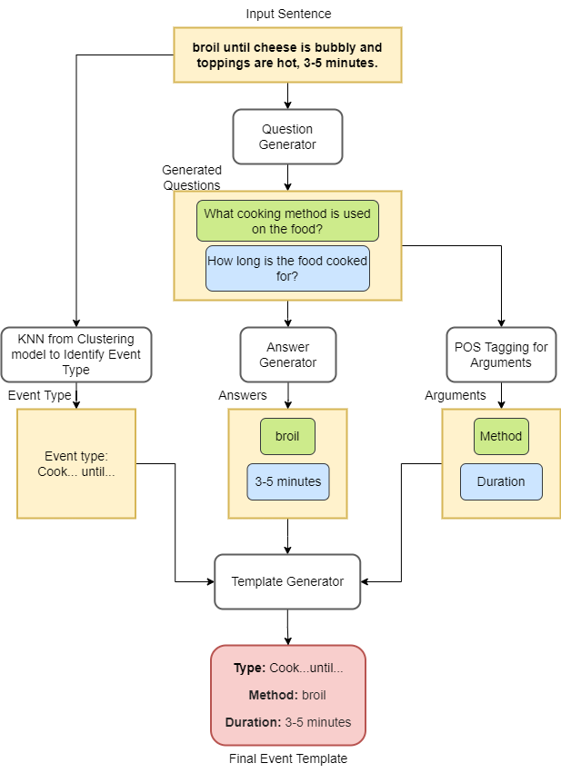
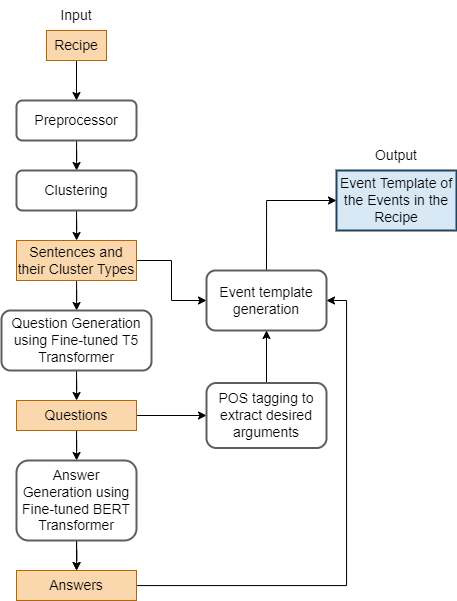
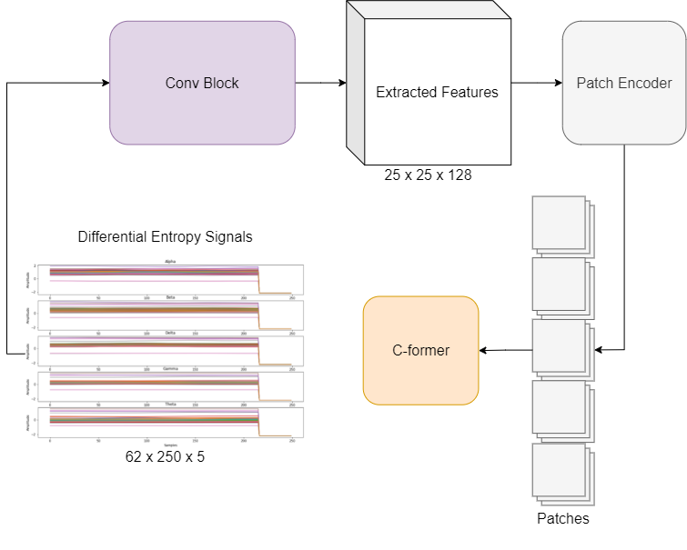
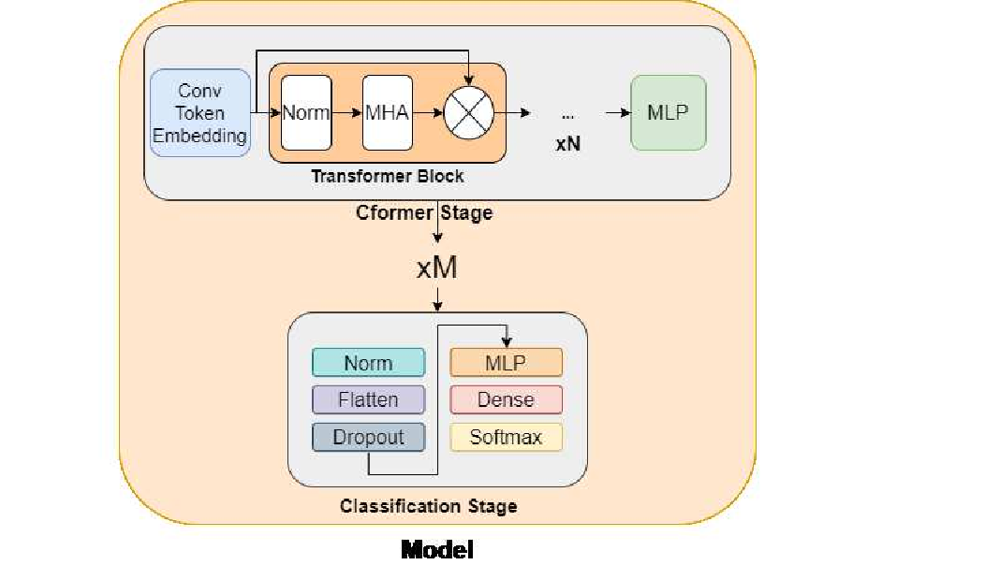

<!-- ### Projects -->
<h1>Projects</h1>

  

    

      <h2 class="subheading-split-left-first">Machine Learning Based Event Extraction from
        Unstructured Data</h2>
      <i>Bachelor's Thesis</i>
    

  

  
Supervisors: <a href="https://www.bits-pilani.ac.in/pilani/surekha-bhanot/">Prof. Surekha Bhanot</a>, <a href="https://personalpages.manchester.ac.uk/staff/riza.batista/">Dr. Riza Batista-Navarro</a>

  

    

        
        
<i>Fig. Event Extraction Example</i>

    

    

        
        
<i>Fig. Model Architecture</i>

    

  

  
This project explored the extraction of cooking-related events from unstructured data, such as online recipes, using advanced machine learning and natural language processing techniques. Recipes are a rich source of information, detailing food preparation steps and methods. The goal was to transform these unstructured texts into structured, machine-readable event templates with minimal reliance on annotated datasets. By combining clustering, interactive machine learning, and transformer-based models, the thesis delivered a robust system for semi-automated event detection.

<h4>Key Contributions:</h4>
<ul class="content-list">
    <li>Innovative Carbon Emission Model: Applied interactive machine learning and machine reading comprehension to create a model that calculates carbon emissions in recipes based on the extracted event templates</li>
    <li>Semi-Supervised Event Extraction: Designed a system that uses HDBScan clustering and human-in-the-loop training to extract events from unstructured data without pre-existing annotations.</li>
    <li>Transformer-Based Question Generation: Fine-tuned BERT and T5 models to generate relevant questions and refine event details. Incorporated POS tagging to improve accuracy in event detection.</li>
    <li>Research Excellence: Demonstrated strong problem-solving, critical thinking, and communication skills through collaborative work with academic mentors and experts. Enhanced teamwork and model design abilities throughout the project.</li>
</ul>

 

    

      <h2 class="subheading-split-left-first">C-Former: A Novel Vision Transformer-Based Architecture for EEG Emotion Classification</h2>
    

    

        
        
<i>Fig. Model Approach</i>

    

    

        
        
<i>Fig. CFormer Block Architecture</i>

    

  

This research introduced C-Former, a cutting-edge transformer-based architecture designed for emotion classification using EEG signals. Electroencephalography (EEG) is a non-invasive method of measuring the brain's electrical activity in response to stimuli and has numerous applications in clinical and research settings. The proposed model incorporates convolutional token embedding layers and a convolutional feature extractor to enhance the representation of spatial and temporal features in EEG data.

The aim was to develop a robust and efficient method for emotion recognition using EEG signals. By leveraging the power of transformers, C-Former addresses challenges such as variations in data and the need for precise feature extraction, outperforming traditional models while maintaining competitive performance with state-of-the-art approaches.

<h4>Key Contributions:</h4>
<ul class="content-list">
<li><b class="light-bold">Transformer-Based Innovation:</b> C-Former combines convolutional layers for token embedding with transformer modules to capture both local and global features in EEG data.</li>
<li><b class="light-bold">Benchmark Performance:</b> Experimental results on the SEED dataset demonstrate that C-Former achieves superior accuracy compared to previous models, while being more robust to variations in input data.</li>
<li><b class="light-bold">First-of-Its-Kind Application: </b>To the best of our knowledge, this is the first work that employs transformers specifically for EEG-based emotion recognition.</li>
</ul>